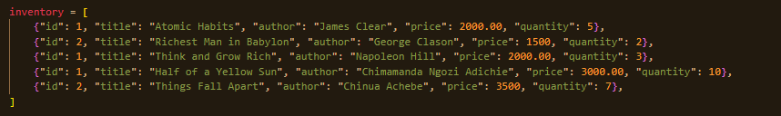
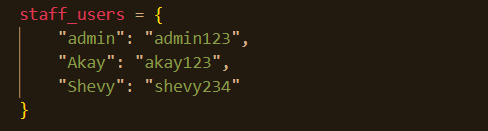
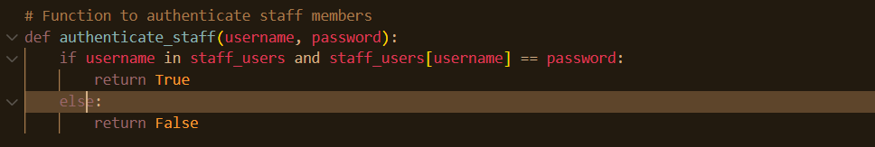
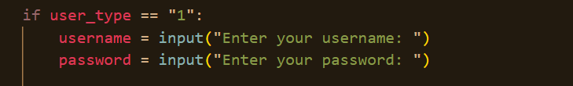
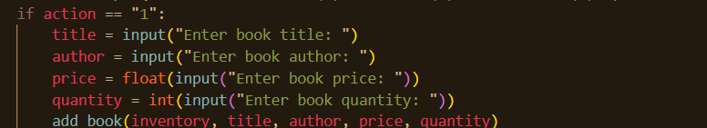
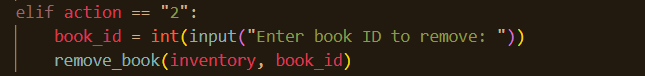
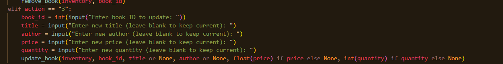
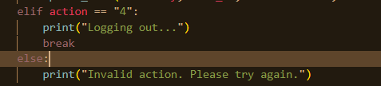
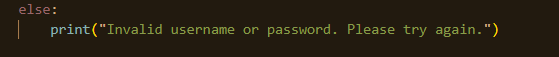

# ONLINE BOOKSTORE MANAGEMENT SYSTEM

### OBJECTIVE: DEVELOP A COMMAND-LINE BASED BOOKSTORE MANAGEMENT SYSTEM USING PYTHON.

#### FEATURES: 

- ABILITY TO ADD, REMOVE AND UPDATE BOOKS IN THE BOOKSTORE INVENTORY.
- IMPLEMENT USER AUTHENTICATION AND AUTHORIZATION FOR STAFF MEMBERS.
- ALLOW CUSTOMERS TO SEARCH FOR BOOKS, VIEW DETAILS, AND MAKE PURCHASE.

#### Prerequite:

- Basic Understanding of Python

We will build a command-line based bookstore management system using python. 

Steps to implement the project:

1. We initialize the inventory list with five sample books. Each book is represented as a dictionary containing keys for id, title, author, price, and quantity. This structure allow us to easily add, remove or update  books in the bookstore.

2. Defines a dictionary staff_users with sample staff usernames and passwords:
  - Keys are usernames.
  - Values are corresponding passwords.
 
 This dictionary will be used for authenticating staff members.

3. The `authenticate_staff` function verifies staff credentials by checking if the provided username exists in the `staff_users` dictionary and if the corresponding password matches the given password. If both conditions are met, the function returns True, indicating successful authentication; otherwise, it returns False.

4. The `add_book` function enables the addition of new books to the inventory. It calculates a unique ID for the new book by incrementing the current inventory count, then appends a dictionary representing the book to the inventory list, including the calculated ID, title, author, price, and quantity. Finally, it prints a confirmation message indicating that the book has been successfully added to the inventory .

5. The `remove_book` function enables the removal of books from the inventory. It checks through each book in the inventory list, checking if the current book's id matches the provided book_id. If a match is found, the function removes the book from the inventory and prints a confirmation message. If no book with the given ID is found after checking through the entire list, the function prints an error message, indicating that the book was not found in the inventory.

6. The `update_book` function enables the modification of existing books in the inventory. It searches the inventory list for a book with the specified `book_id` and, if found, updates the book's attributes (title, author, price, quantity) with new values provided (excluding None values). Upon successful update, the function prints a confirmation message. If the book with the given ID is not found in the inventory, the function prints an error message, indicating that the book was not located.

7. The `search_books` function enables searching for books in the inventory by title or author. It utilizes a list comprehension to filter books whose title or author contains the specified `search_term`, performing a case-insensitive search. The function then returns a list of books that match the search criteria, allowing for easy retrieval of relevant books.

8. The `view_book_details` function displays the detailed information of a specified book. It takes a book as input and prints its attributes, including the book's id, title, author, price, and quantity, providing a concise overview of the book's details.

9. The `purchase_book` function facilitates the purchase of a book by checking its availability and updating the inventory accordingly. It searches the inventory for the book with the specified `book_id` and:

10. The `while True` immediately after `def main()` function starts an infinite loop. This loop will continue running until a break statement is executed. It allows the user to repeatedly perform actions without restarting the program. 

11. The `if user_type == "1":` Checks if the user has selected option 1, indicating they are a staff member. If they did, the `username = input("Enter your username: ")` prompts the staff user to enter their username and stores it in the username variable. While the `password = input("Enter your password: ")` prompts the staff user to enter their password and stores it in the password variable.

12. The `if authenticate_staff(username, password):` calls the function authenticate_staff with username and password as arguments. If the authentication is successful (i.e., returns True), the code inside this block will execute. The `print("Welcome, staff member!")` displays a welcome message indicating that the staff user has successfully logged in. 

13. The `while True:` starts another infinite loop specific to the authenticated staff user. This loop allows the staff member to continuously perform actions until they choose to log out. The `action = input("Choose an action: (1) Add Book (2) Remove Book (3) Update Book (4) Logout: ")` Prompts the staff user to choose an action by entering a number. The input is stored in the action variable. Each action corresponds to specific functions:
- Add Book: Prompts for book details (title, author, price, quantity) and calls add_book() to add it to the inventory.
- Remove Book: Prompts for the book ID to remove and calls remove_book() to delete it from the inventory.
- Update Book: Prompts for the book ID and new details (optional). Calls update_book() to modify the book information.
- Logout: Exits the staff action loop and returns to the main program loop.

14. When the user selects option 1, the program prompts them to enter the details of the new book:
- Title: The user is asked to enter the book's title, which is stored in the title variable.
- Author: The user is asked to enter the book's author, which is stored in the author variable.
- Price: The user is asked to enter the book's price, which is converted to a floating-point number and stored in the price variable.
- Quantity: The user is asked to enter the book's quantity, which is converted to an integer and stored in the quantity variable.

Once the user has entered all the details, the `add_book` function is called, passing the `inventory` list and the entered book details as arguments. This function adds the new book to the `inventory` list, updating the catalog with the fresh entry.

15. When the user selects option 2, the program initiates the book removal process:
- The user is prompted to enter the ID of the book they want to remove, which is converted to an integer and stored in the book_id variable.
- The `remove_book` function is called, passing the `inventory` list and `book_id` as arguments. This function searches for the book with the specified ID in the inventory and removes it, updating the catalog accordingly.

This process allows users to delete books from the inventory by providing the corresponding book ID.

16. If the user selects option 3, the program prints a farewell message `("Goodbye!")` and exits the customer-specific while True loop using the break statement, ending the customer interaction session.

17. If the user enters an input that doesn't match any valid options (1, 2, or 3), the program prints an error message `("Invalid action. Please try again.")` to inform the user of the incorrect input and prompts them to try again.

18. The `else: print("Invalid username or password. Please try again.")` block executes if the authentication failed that is `authenticate_staff` returned False which then display a message indicating that the login attempt was unsuccessful.

19. The `elif user_type == "2":` checks if the user selected option 2, indicating they are a customer. Then `print("Welcome, customer!")` displays a welcome message for the customer. The `while True:` command starts another infinite loop specific to the customer, allowing them to perform actions repeatedly. The `action = input("Choose an action: (1) Search Books (2) Purchase Book (3) Exit: ")` prompts the customer to choose an action and stores the input in the action variable.

20. When the customer selects option 1, the program initiates a book search:
- The customer is then prompted to enter a search term (title or author), which is stored in the `search_term` variable.
- The `search_books` function is called, passing the inventory list and `search_term` as arguments. This function returns a list of books matching the search term, stored in the results variable.
- If the results list is not empty (i.e., books were found), the program:
    - Iterates over each book in the results list using a for loop.
    - Calls the `view_book_details` function to display the details of each book.
- If the results list is empty (i.e., no books matched the search term), the program executes the else block, likely displaying a message indicating no results found.

21. When the customer selects option 2, the program initiates a book purchase:
- The customer is prompted to enter the ID of the book they wish to purchase, which is converted to an integer and stored in the book_id variable.
- The purchase_book function is called, passing the inventory list and book_id as arguments. This function:
    - Checks if the book with the specified ID is available in the inventory.
    - If available, updates the book's quantity and prints a thank-you message.
    - If not available, prints a message indicating the book is out of stock.

22. When the customer selects option 3, the program initiates an exit sequence:
- The program prints a farewell message ("Goodbye!") to the customer.
- The break statement is executed, which:
    - Terminates the customer-specific while True loop.
    - Ends the customer interaction session.

23. If the customer enters an input that doesn't match any valid options (1, 2, or 3), the program:
- Prints an error message ("Invalid action. Please try again.") to inform the customer of the incorrect input.
- Allows the customer to try again, as the while True loop continues to execute.

24. If the customer enters an input that doesn't match any valid options (1, 2, or 3), the program:
- Prints an error message ("Invalid action. Please try again.") to inform the customer of the incorrect input.
- Allows the customer to try again, as the while True loop continues to execute.

25. The `if __name__ == "__main__": main()` command checks if the script is being run directly, as opposed to being imported as a module into another script. If it is run directly, it calls the main() function to start the program. Its a standard Python convention used to control the execution of code, ensuring that main() is executed only when the script is executed directly by the user.

# END OF ONLINE BOOKSTORE MANAGEMENT SYSTEM PROJECT

