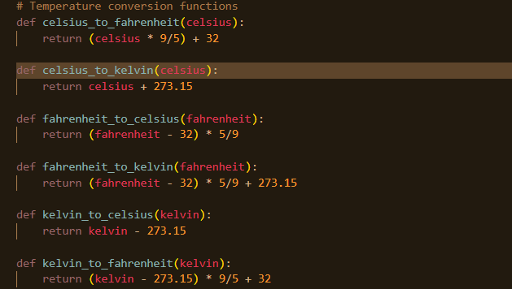
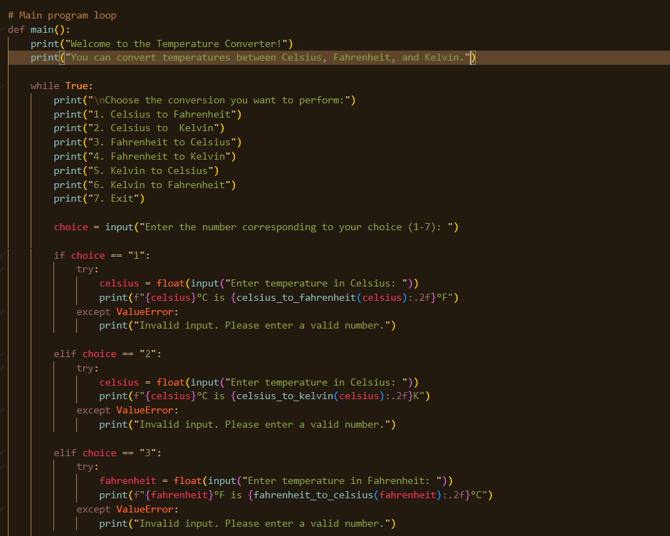
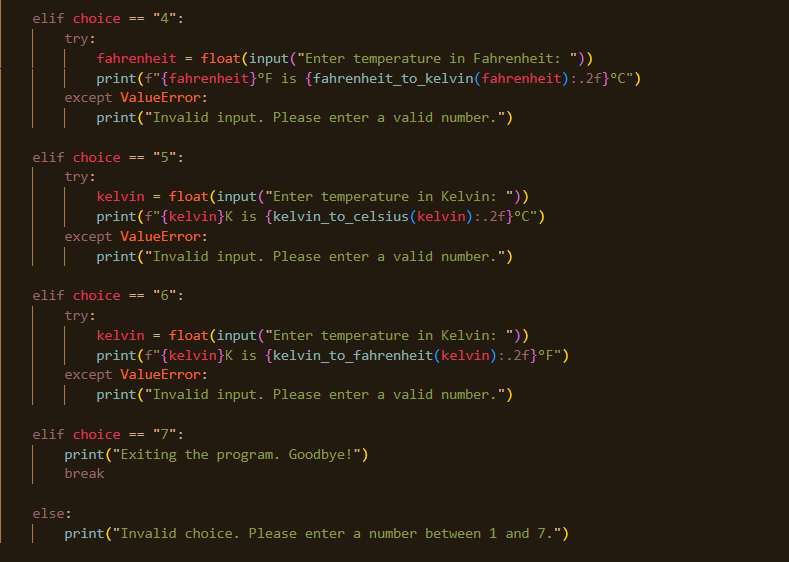

# Project: Temperature Converter

## Objective: Develop a Python program for converting temperatures between Celsius, Fahrenheit, and Kelvin.
  
### Features:
- Allow users to input temperature values in one unit and convert them to other units.
- Support conversion between Celsius, Fahrenheit, and Kelvin scales.
- Implement error handling for invalid input values.
- Provide a clear and user-friendly command-line interface with prompts and instructions.

1. Temperature Conversion Functions:

- *celsius_to_fahrenheit(celsius)*: Converts Celsius to Fahrenheit using the formula: F = (C * 9/5) + 32.
   - *celsius_to_kelvin(celsius)*: Converts Celsius to Kelvin using the formula: K = C + 273.15.
   - *fahrenheit_to_celsius(fahrenheit)*: Converts Fahrenheit to Celsius using the formula: C = (F - 32) * 5/9.
   - *fahrenheit_to_kelvin(fahrenheit)*: Converts Fahrenheit to Kelvin by first converting to Celsius and then to Kelvin.
   - *kelvin_to_celsius(kelvin)*: Converts Kelvin to Celsius using the formula: C = K - 273.15.
   - *kelvin_to_fahrenheit(kelvin)*: Converts Kelvin to Fahrenheit by first converting to Celsius and then to Fahrenheit.

2. *Main Program Loop* `(main() function)`:
- *User Greeting*: Prints a welcome message and explains the purpose of the program.
- *Menu Display*: Continuously displays a menu with options to convert temperatures or exit the program.
- *User Input Handling*:
     - Prompts the user to select a conversion option or exit.
     - Validates the user's choice to ensure it's between 1 and 4.
     - If the user selects an option to convert temperatures, prompts them to enter the temperature value.
     - Uses try and except blocks to handle invalid input (e.g., non-numeric values) gracefully by displaying an error message.
   - *Perform Conversions*:
     - Depending on the user's choice, the appropriate conversion function is called, and the results are displayed.
     - Each conversion result is rounded to two decimal places for clarity.
   - *Exit Option*: If the user chooses to exit, the program breaks out of the loop and displays a goodbye message.
  

3. The line `if __name__ == "__main__": main()` ensures that the `main()` function is called only when the script is run directly, not when imported as a module.

# END OF TEMPERATURE CONVERSION PROJECT