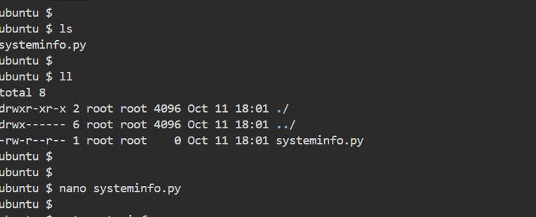

# Project: System Information Display Tool with Python and Linux
## Objective: Develop a Python script to retrieve and display system information on a Linux-based operating system.
### Features:
#### Basic System Information:
- Display the hostname, kernel version, and distribution of the Linux system.
#### CPU Information:
- Retrieve details about the CPU, such as the model, architecture, and number of cores.
- Optionally, display CPU temperature if available.
#### Memory Information:
- Show the total, used, and free memory available on the system.
#### Disk Usage:
- Display disk usage statistics for each mounted partition, including total, used, and available space.
- Highlight any partitions that are close to full capacity.
#### Network Information:
- Retrieve details about network interfaces, including IP addresses, MAC addresses, and current network activity.
#### Uptime:
- Show the system uptime since the last boot.
### Additional Features:
- Colorized Output: Enhance the output with color-coding to make it more readable and visually appealing.
- Interactive Mode: Allow users to choose which information they want to display interactively. 
- Error Handling: Implement error handling to gracefully handle cases where certain information cannot be retrieved.

Open linux ubuntu and run the following command:

sudo apt update: Updates the package list to the latest versions from repositories.

ls: Lists the files and directories in the current directory.

sudo apt-get install python3-psutil: Installs the psutil library for Python 3 to retrieve system information.

pwd: Prints the current directory’s path.

mkdir sysinfo: Creates new directories called sysinfo

cd sysinfo: Changes to the sysinfo directory.

touch systeminfo.py: Creates an empty Python file named systeminfo.py.

nano systeminfo.py: Opens systeminfo.py in the nano text editor to write code. This is where we paste all the python code we are to run and save it.

python3 systeminfo.py: Runs the systeminfo.py Python script using Python 3.

When we run python3 systeminfo.py, we see it runs the file for systeminfo.py. Below is the python code in the systeminfo.py file and their usage

### *1. Module Imports*

python
import os
import platform
import psutil
import subprocess
from termcolor import colored

- *os*: Provides functions to interact with the operating system. We use it to get system information like uptime.
- *platform*: Used to retrieve system details like the operating system version, kernel, and processor architecture.
- *psutil*: A powerful library for retrieving system and hardware information such as CPU, memory, and disk usage.
- *subprocess*: Helps in running Linux shell commands from Python, especially for retrieving system information like CPU temperature and network details.
- *termcolor*: Adds color to the terminal output, making the displayed information more readable and visually appealing.

### *2. Basic System Information Retrieval*

def get_basic_info():
    hostname = platform.node()
    kernel_version = platform.release()
    distribution = ' '.join(platform.linux_distribution())
    
    print(colored(f"Hostname: {hostname}", 'cyan'))
    print(colored(f"Kernel Version: {kernel_version}", 'cyan'))
    print(colored(f"Distribution: {distribution}", 'cyan'))

- *get_basic_info()*: Retrieves and displays basic system information.
  - *platform.node()*: Gets the system's hostname.
  - *platform.release()*: Retrieves the kernel version of the OS.
  - *platform.linux_distribution()*: Gets the Linux distribution name and version.
  - *colored()*: Uses termcolor to print the information in a specified color (cyan in this case).

### *3. CPU Information Retrieval*

python
def get_cpu_info():
    cpu_model = platform.processor()
    architecture = platform.machine()
    cores = psutil.cpu_count(logical=False)
    logical_cores = psutil.cpu_count(logical=True)
    
    print(colored(f"CPU Model: {cpu_model}", 'yellow'))
    print(colored(f"Architecture: {architecture}", 'yellow'))
    print(colored(f"Physical Cores: {cores}", 'yellow'))
    print(colored(f"Logical Cores: {logical_cores}", 'yellow'))
    
    try:
        temp_output = subprocess.check_output("sensors | grep 'Package id 0'", shell=True).decode('utf-8').strip()
        print(colored(f"CPU Temperature: {temp_output}", 'yellow'))
    except:
        print(colored("CPU Temperature: Could not retrieve", 'yellow'))

- *get_cpu_info()*: Retrieves CPU information.
  - *platform.processor()*: Retrieves the CPU model.
  - *platform.machine()*: Returns the architecture (e.g., x86_64).
  - *psutil.cpu_count(logical=False)*: Gets the number of physical cores.
  - *psutil.cpu_count(logical=True)*: Gets the number of logical cores (including hyperthreading).
  - *subprocess.check_output()*: Runs a Linux command (sensors | grep 'Package id 0') to fetch CPU temperature using the sensors command.
  - *colored()*: Colors the CPU information in yellow.

### *4. Memory Information Retrieval*

def get_memory_info():
    memory = psutil.virtual_memory()
    total = memory.total / (1024 ** 3)
    used = memory.used / (1024 ** 3)
    available = memory.available / (1024 ** 3)
    
    print(colored(f"Total Memory: {total:.2f} GB", 'green'))
    print(colored(f"Used Memory: {used:.2f} GB", 'green'))
    print(colored(f"Available Memory: {available:.2f} GB", 'green'))

- *get_memory_info()*: Retrieves memory usage statistics.
  - *psutil.virtual_memory()*: Returns memory usage details (total, used, available memory).
  - *memory.total*: Total available memory (in bytes).
  - *memory.used*: Used memory.
  - *memory.available*: Available memory.
  - *Memory values*: Converted from bytes to gigabytes for display using (1024 ** 3) to divide by 1 GB.
  - *colored()*: Colors the memory information in green

  ### *5. Disk Usage Information*

def get_disk_usage():
    partitions = psutil.disk_partitions()
    
    for partition in partitions:
        usage = psutil.disk_usage(partition.mountpoint)
        total = usage.total / (1024 ** 3)
        used = usage.used / (1024 ** 3)
        free = usage.free / (1024 ** 3)
        percent_used = usage.percent
        
        print(colored(f"Partition: {partition.device}", 'magenta'))
        print(colored(f"  Mountpoint: {partition.mountpoint}", 'magenta'))
        print(colored(f"  Total: {total:.2f} GB", 'magenta'))
        print(colored(f"  Used: {used:.2f} GB ({percent_used}%)", 'magenta'))
        print(colored(f"  Free: {free:.2f} GB", 'magenta'))
        
        if percent_used > 80:
            print(colored("  Warning: Partition is more than 80% full!", 'red'))

- *get_disk_usage()*: Retrieves disk usage information for each partition.
  - *psutil.disk_partitions()*: Returns a list of mounted disk partitions.
  - *psutil.disk_usage(partition.mountpoint)*: Retrieves disk usage statistics for a given partition.
  - *Usage values*: Disk usage details like total, used, free space are converted to gigabytes and displayed.
  - *Warning*: If a partition is over 80% full, a warning message is displayed in red using termcolor.

### *6. Network Information Retrieval*

def get_network_info():
    interfaces = psutil.net_if_addrs()
    for interface, addresses in interfaces.items():
        print(colored(f"Interface: {interface}", 'blue'))
        for address in addresses:
            if address.family == socket.AF_INET:
                print(colored(f"  IP Address: {address.address}", 'blue'))
            elif address.family == socket.AF_PACKET:
                print(colored(f"  MAC Address: {address.address}", 'blue'))

- *get_network_info()*: Retrieves network interface information.
  - *psutil.net_if_addrs()*: Returns network interface addresses (IP and MAC addresses) for each network interface.
  - *IP and MAC Addresses*: Differentiated using address.family to determine whether the address is an IP (socket.AF_INET) or a MAC address (socket.AF_PACKET).
  - *colored()*: Colors the network information in blue.

### *7. Uptime Retrieval*

def get_uptime():
    uptime_seconds = float(os.popen("awk '{print $1}' /proc/uptime").readline().strip())
    uptime_string = str(timedelta(seconds = uptime_seconds))
    print(colored(f"Uptime: {uptime_string}", 'cyan'))

- *get_uptime()*: Retrieves the system uptime.
  - *os.popen("awk '{print $1}' /proc/uptime").readline()*: Runs a Linux command to read the uptime value from /proc/uptime.
  - *timedelta(seconds=uptime_seconds)*: Converts the uptime (in seconds) into a human-readable format (hours, minutes, seconds).
  - *colored()*: Colors the uptime information in cyan.

### *8. Interactive Mode*

def interactive_mode():
    while True:
        print(colored("\nChoose an option to display:", 'yellow'))
        print(colored("1. Basic System Information", 'yellow'))
        print(colored("2.CPU Information", 'yellow'))
        print(colored("3. Memory Information", 'yellow'))
        print(colored("4. Disk Usage", 'yellow'))
        print(colored("5. Network Information", 'yellow'))
        print(colored("6. Uptime", 'yellow'))
        print(colored("7. Exit", 'yellow'))
        
        choice = input(colored("Enter your choice: ", 'yellow'))
        
        if choice == "1":
            get_basic_info()
        elif choice == "2":
            get_cpu_info()
        elif choice == "3":
            get_memory_info()
        elif choice == "4":
            get_disk_usage()
        elif choice == "5":
            get_network_info()
        elif choice == "6":
            get_uptime()
        elif choice == "7":
            print(colored("Exiting...", 'yellow'))
            break
        else:
            print(colored("Invalid option. Please try again.", 'red'))

- *interactive_mode()*: Provides a user-friendly command-line interface for selecting which system information to display.
  - Displays a numbered list of options (Basic System Info, CPU Info, etc.) using colored() for enhanced readability.
  - Based on the user's input, the corresponding function (e.g., get_cpu_info()) is called to display the desired information.
  - If the user selects "7", the loop breaks, and the program exits.

