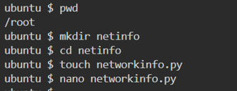

# Project: Basic Network Information Retrieval Tool
## Objective: Develop a Python script to retrieve network information from the local system.
### Features:
#### IP Address Display:
- Retrieve and display the IP address of the local machine.
#### Network Interface Information:
- List available network interfaces along with their corresponding IP addresses and MAC addresses.
####  Ping Test:
- Allow users to input a host or IP address and perform a ping test to check for connectivity.
- Display the results of the ping test, including response times and packet loss.

---------------------------------------------------------------------------------------------------------------

Open linux ubuntu and run the following command:

sudo apt update: Updates the package list to the latest versions from repositories.

ls: Lists the files and directories in the current directory.

sudo apt-get install python3-psutil: Installs the psutil library for Python 3 to retrieve system information.

pwd: Prints the current directory’s path.

mkdir netinfo: Creates new directories called sysinfo

cd netinfo: Changes to the sysinfo directory.

touch networkinfo.py: Creates an empty Python file named networkinfo.py.

nano networkinfo.py: Opens networkinfo.py in the nano text editor to write code. This is where we paste all the python code we are to run and save it.

python3 networkinfo.py: Runs the systeminfo.py Python script using Python 3.

##    END OF PROJECT