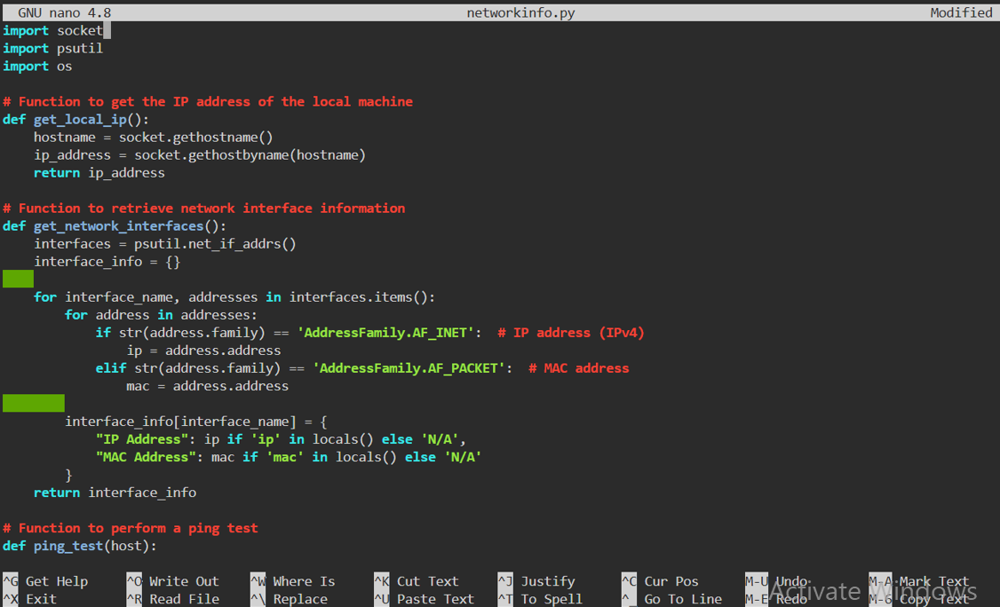
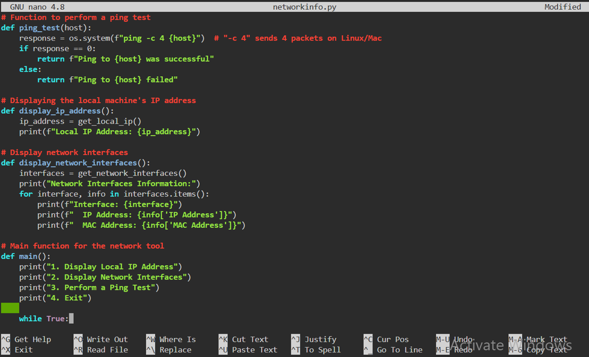
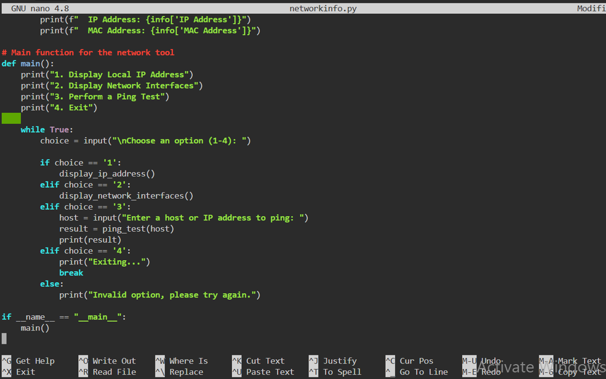

# Project: Basic Network Information Retrieval Tool
## Objective: Develop a Python script to retrieve network information from the local system.
### Features:
#### IP Address Display:
- Retrieve and display the IP address of the local machine.
#### Network Interface Information:
- List available network interfaces along with their corresponding IP addresses and MAC addresses.
####  Ping Test:
- Allow users to input a host or IP address and perform a ping test to check for connectivity.
- Display the results of the ping test, including response times and packet loss.

---------------------------------------------------------------------------------------------------------------

Open linux ubuntu and run the following command:

sudo apt update: Updates the package list to the latest versions from repositories.

ls: Lists the files and directories in the current directory.

sudo apt-get install python3-psutil: Installs the psutil library for Python 3 to retrieve system information.

pwd: Prints the current directory’s path.

mkdir netinfo: Creates new directories called sysinfo

cd netinfo: Changes to the sysinfo directory.

touch networkinfo.py: Creates an empty Python file named networkinfo.py.

nano networkinfo.py: Opens networkinfo.py in the nano text editor to write code. This is where we paste all the python code we are to run and save it.

python3 networkinfo.py: Runs the systeminfo.py Python script using Python 3.

See the python code used in the networkinfo.py below 

import psutil
import socket
import os

- *import psutil*: This imports the psutil library, which allows access to system information, such as network interface data and IP addresses.
- *import socket*: This module provides access to low-level networking interfaces, such as working with IP addresses, hostnames, etc.
- *import os*: This module is used for providing functions to interact with the operating system. We use it to get system information like uptime.

### *IP Address Display*

def get_ip_address():
    hostname = socket.gethostname()
    ip_address = socket.gethostbyname(hostname)
    print(colored(f"Hostname: {hostname}", 'cyan'))
    print(colored(f"IP Address: {ip_address}", 'cyan'))

- *def get_ip_address():*: This defines a function that retrieves the system’s hostname and IP address.
- *hostname = socket.gethostname()*: Uses the socket library to get the hostname of the local machine.
- *ip_address = socket.gethostbyname(hostname)*: Retrieves the IP address of the machine by resolving its hostname.
- *print(colored(f"Hostname: {hostname}", 'cyan'))*: Prints the hostname in cyan color.
- *print(colored(f"IP Address: {ip_address}", 'cyan'))*: Prints the IP address in cyan color.

### *Network Interface Information*

def get_network_interfaces():
    interfaces = psutil.net_if_addrs()
    for interface, addresses in interfaces.items():
        print(colored(f"Interface: {interface}", 'blue'))
        for address in addresses:
            if address.family == socket.AF_INET:
                print(colored(f"  IP Address: {address.address}", 'blue'))
            elif address.family == socket.AF_PACKET:
                print(colored(f"  MAC Address: {address.address}", 'blue'))

- *def get_network_interfaces():*: Defines a function to list all the network interfaces on the system.
- *interfaces = psutil.net_if_addrs()*: Uses psutil to retrieve the network interface addresses, including IP and MAC addresses, for all interfaces.
- *for interface, addresses in interfaces.items():*: Loops through all the available network interfaces and their associated addresses (both IP and MAC).
  - *print(colored(f"Interface: {interface}", 'blue'))*: Prints the name of the network interface (e.g., eth0, wlan0) in blue.
  - *for address in addresses:*: Loops through each address (IP and MAC) associated with the current network interface.
    - *if address.family == socket.AF_INET:*: Checks if the address is an IPv4 address using the socket.AF_INET family.
      - *print(colored(f"  IP Address: {address.address}", 'blue'))*: Prints the IP address for the network interface in blue.
    - *elif address.family == socket.AF_PACKET:*: Checks if the address is a MAC address using socket.AF_PACKET.
      - *print(colored(f"  MAC Address: {address.address}", 'blue'))*: Prints the MAC address in blue.

### *Ping Test*

python
def ping_test(host):
    try:
        output = subprocess.check_output(f"ping -c 4 {host}", shell=True).decode('utf-8')
        print(colored(output, 'green'))
    except subprocess.CalledProcessError:
        print(colored(f"Failed to ping {host}", 'red'))

- *def ping_test(host):*: Defines a function that performs a ping test to check connectivity to a specified host or IP address.
- *try:*: Starts a try block to attempt to run the ping command and capture its output.
  - *output = subprocess.check_output(f"ping -c 4 {host}", shell=True).decode('utf-8')*: Uses the subprocess.check_output() function to run the ping command with the -c 4 option (which sends 4 packets). The output of the command is captured and decoded from bytes to a string.
  - *print(colored(output, 'green'))*: Prints the output of the ping command in green to indicate success.
- *except subprocess.CalledProcessError:*: Catches errors if the ping command fails (e.g., no network connectivity).
  - *print(colored(f"Failed to ping {host}", 'red'))*: If an error occurs, prints an error message in red.

### *Main Program Loop*

def main():
    while True:
        print(colored("\nChoose an option:", 'yellow'))
        print(colored("1. Display IP Address", 'yellow'))
        print(colored("2. Display Network Interfaces", 'yellow'))
        print(colored("3. Ping Test", 'yellow'))
        print(colored("4. Exit", 'yellow'))
        
        choice = input(colored("Enter your choice: ", 'yellow'))
        
        if choice == "1":
            get_ip_address()
        elif choice == "2":
            get_network_interfaces()
        elif choice == "3":
            host = input(colored("Enter a host or IP address to ping: ", 'yellow'))
            ping_test(host)
        elif choice == "4":
            print(colored("Exiting...", 'yellow'))
            break
        else:
            print(colored("Invalid choice. Please try again.", 'red'))

- *def main():*: This defines the main function, which provides an interactive menu for the user to choose different network-related options.
- *while True:*: This creates an infinite loop to keep the program running until the user chooses to exit.
  - *print(colored(..., 'yellow'))*: The program displays the options for the user to choose (e.g., Display IP Address, Display Network Interfaces, Ping Test, Exit). The text is printed in yellow.
  - *choice = input(colored(..., 'yellow'))*: Prompts the user to enter their choice, and the input is highlighted in yellow.
- *if choice == "1":*: If the user selects option 1, the get_ip_address() function is called to display the IP address.
- *elif choice == "2":*: If the user selects option 2, the get_network_interfaces() function is called to display network interfaces.
- *elif choice == "3":*: If the user selects option 3, the program asks for a host or IP address and performs a ping test using the ping_test() function.
  - *host = input(colored(..., 'yellow'))*: Prompts the user to enter a host or IP address to ping.
  - *ping_test(host)*: Runs the ping test on the entered host or IP address.
- *elif choice == "4":*: If the user selects option 4, the program prints an "Exiting..." message and breaks out of the loop, ending the program.
- *else:*: If the user enters an invalid option, an error message is printed in red, and the loop continues.

### *Run the Program*

if __name__ == "__main__":
    main()

- *if __name__ == "__main__":*: This checks if the script is being run directly (not imported as a module), and if so, calls the main() function to start the program.

##    END OF PROJECT